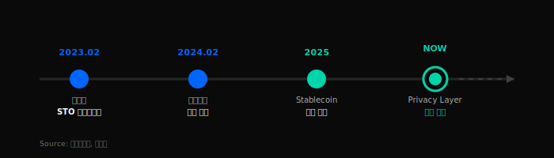
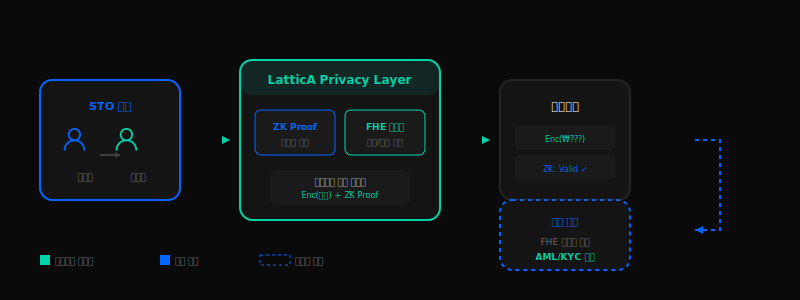

# STO Payment Leg을 위한
# **프라이버시 인프라**

토큰증권(STO) 결제 시 거래 정보 보호 및 규제 준수를 동시에 달성

---



## 한국 STO 시장 현황

| 시점 | 내용 |
|------|------|
| 2023.02 | 금융위 STO 가이드라인 발표 |
| 2024.02 | 토큰증권 발행 시작 |
| 2025 | Stablecoin 결제 논의 중 |

**11개** 기업이 STO 발행 완료 (2025.01 기준)

> 출처: [금융위원회](https://www.fsc.go.kr/no010101/79241), [한국경제](https://www.hankyung.com/article/202501027181i)

---

## 문제: STO 결제 시 정보 노출

<div class="columns">
<div class="column">

### 거래 금액 노출
- 블록체인 상 모든 결제 내역 공개
- 경쟁사가 거래 규모 파악 가능

</div>
<div class="column">

### 거래 관계 노출
- 누가 누구와 거래하는지 추적 가능
- 기업 전략 및 파트너십 유출 우려

</div>
</div>

**현재 상황**: Stablecoin 결제가 시작되면 모든 거래 내역이 체인에 기록 → 경쟁사/제3자가 분석 가능

---

## 기존 방식의 한계

| 기능 | 일반 블록체인 | 프라이빗 체인 | **LatticA** |
|------|:---:|:---:|:---:|
| 금액 비공개 | ❌ | 제한적 | ✅ |
| 주소 비공개 | ❌ | 내부만 | ✅ |
| 규제 준수 (AML/KYC) | ✅ | ✅ | ✅ |
| 감독 기관 감사 | ✅ | 제한적 | ✅ |

**핵심**: 프라이버시 + 규제준수 = 양립 가능해야 함
→ **LatticA는 둘 다 제공**

---



## ZK + FHE 아키텍처

**영지식 증명 (ZKP)**
데이터 공개 없이 유효성 검증

**동형암호 (FHE)**
암호화 상태로 연산 수행

**MPC Threshold**
다자간 연산으로 복호화 분산

---

## 코스콤 STO 적용 시나리오

```
[1. STO 발행] → [2. Stablecoin 결제] → [3. LatticA Privacy Layer] → [4. 규제 준수]
```

| 이해관계자 | 혜택 |
|-----------|------|
| **기업 고객** | 경쟁사에 거래 정보 비공개, 전략적 M&A/투자 정보 보호 |
| **코스콤** | 차별화된 STO 인프라, 프라이버시 기능으로 경쟁력 확보 |
| **금융당국** | 필요시 암호화 상태로 감사, AML/KYC 규정 완전 준수 |

---

## Why LatticA

| 항목 | 내용 |
|------|------|
| **FHE 성능** | ZAMA 대비 **1.9x** 빠른 부트스트래핑 |
| **Cross-Platform** | CPU/GPU/FPGA 동일 결과 (NTT 기반) |
| **Compliance** | AML/KYC + 감사 로그 내장 |

**Production Ready** - PoC 즉시 진행 가능

> 출처: [ePrint 2025/2150](https://eprint.iacr.org/2025/2150)

---

## 협력 방안: 코스콤과 함께

| Phase | 기간 | 내용 |
|-------|------|------|
| **Phase 1** | 1-2개월 | PoC 구축 - 테스트넷에서 Privacy Layer 검증 |
| **Phase 2** | 3-4개월 | 파일럿 - 선별 고객사 대상 실증 |
| **Phase 3** | 6개월+ | 상용화 - STO 결제 시스템 정식 통합 |

---

# 감사합니다

**LatticA** | ZK + FHE Infrastructure

📧 contact@lattica.io
🔗 lattica.io

> [KOSCOM](https://www.koscom.co.kr) | [금융위 STO 가이드라인](https://www.fsc.go.kr/no010101/79241)
